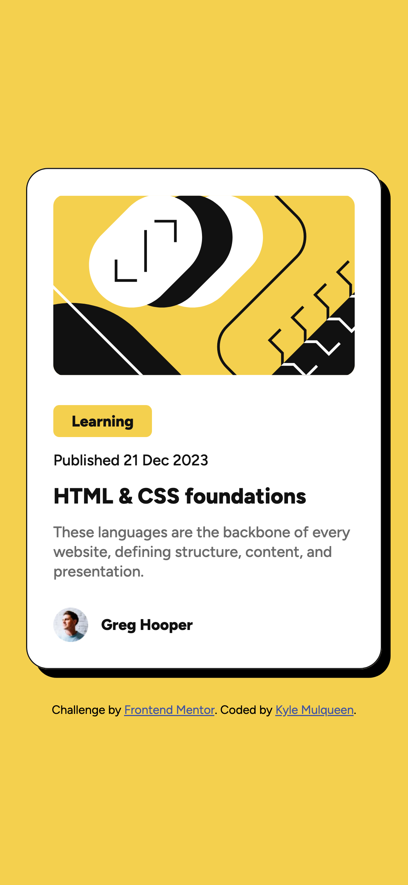

# Frontend Mentor - Blog preview card solution

This is a solution to the [Blog preview card challenge on Frontend Mentor](https://www.frontendmentor.io/challenges/blog-preview-card-ckPaj01IcS). Frontend Mentor challenges help you improve your coding skills by building realistic projects.

## Table of contents

- [Frontend Mentor - Blog preview card solution](#frontend-mentor---blog-preview-card-solution)
  - [Table of contents](#table-of-contents)
  - [Overview](#overview)
    - [The challenge](#the-challenge)
    - [Screenshot](#screenshot)
    - [Links](#links)
  - [My process](#my-process)
    - [Built with](#built-with)
    - [What I learned](#what-i-learned)
    - [Continued development](#continued-development)
    - [Useful resources](#useful-resources)
  - [Author](#author)
  - [Acknowledgments](#acknowledgments)

## Overview

### The challenge

Users should be able to:

- See hover and focus states for all interactive elements on the page

### Screenshot




### Links

- Solution URL: [GitHub Pages](https://kmulqueen.github.io/blog-preview-card-challenge/)

## My process

### Built with

- Semantic HTML5 markup
- CSS custom properties
- Flexbox
- Mobile-first workflow

### What I learned

I learned about implementing interactive hover effects using CSS. Specifically, I deepened my understanding of the box-shadow property to create a subtle elevation effect and how to target child elements when a parent is hovered using descendant selectors. I also learned how to use the transition property to create smooth animations between states rather than immediate changes.

One of the key insights was understanding that transitions need to be applied to the base element rather than just the hover state to ensure smooth transitions in both directions:

```css
.card {
  box-shadow: var(--spacing-small) var(--spacing-small) 0 0 #000000;
  transition: box-shadow 0.3s cubic-bezier(0.47, 0, 0.74, 0.71);
}

.card:hover {
  box-shadow: var(--spacing-medium) var(--spacing-medium) 0 0 #000000;
  cursor: pointer;
}

.card:hover .card-title {
  color: var(--color-yellow);
}
```

I also improved my understanding of CSS variables (custom properties) for creating a consistent design system that made adjustments much easier:

```css
:root {
  --font-size-large: 2rem;
  --font-size-medium: 1.6rem;
  --font-size-small: 1.4rem;
  --font-weight-bold: 800;
  --font-weight-medium: 500;
}
```

### Continued development

In future projects, I'd like to focus more on:

- Creating more complex hover animations and transitions
- Exploring CSS Grid for more advanced layouts
- Implementing accessibility features to ensure all interactive elements are usable by keyboard-only users
- Learning about CSS transforms to create more dynamic visual effects
- Exploring responsive design techniques beyond simple media queries

### Useful resources

- [MDN Web Docs - CSS Descendant Combinator](https://developer.mozilla.org/en-US/docs/Web/CSS/Descendant_combinator) - This helped me understand how to target elements based on their ancestors, which was critical for implementing the hover effect on the card title.
- [MDN Web Docs - CSS Transitions](https://developer.mozilla.org/en-US/docs/Web/CSS/CSS_transitions/Using_CSS_transitions) - This resource explained how transitions work in CSS and why they need to be applied to the base element rather than just the hover state.
- [CSS-Tricks - Box-Shadow](https://css-tricks.com/almanac/properties/b/box-shadow/) - A comprehensive guide that helped me understand the various parameters of the box-shadow property.

## Author

- Website - [Kyle Mulqueen](https://github.com/kmulqueen)
- Frontend Mentor - [@kmulqueen](https://www.frontendmentor.io/profile/kmulqueen)

## Acknowledgments

I'd like to thank the Frontend Mentor community for providing these challenges and feedback. The resources available on MDN Web Docs were also incredibly helpful in finding solutions to the specific problems I encountered during this project.
